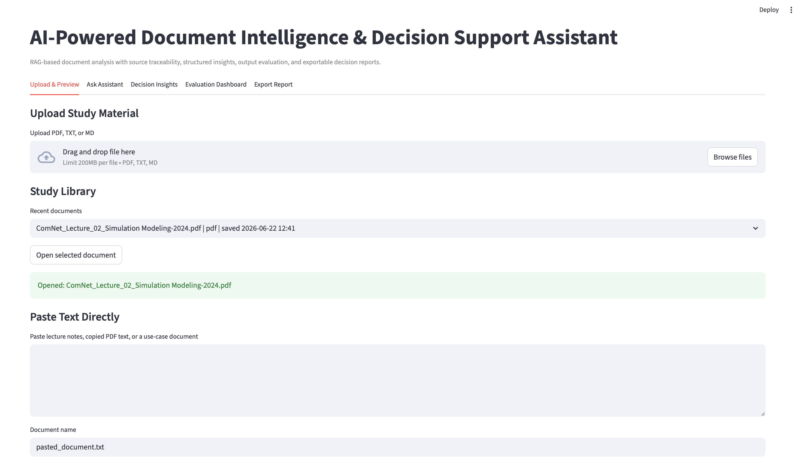
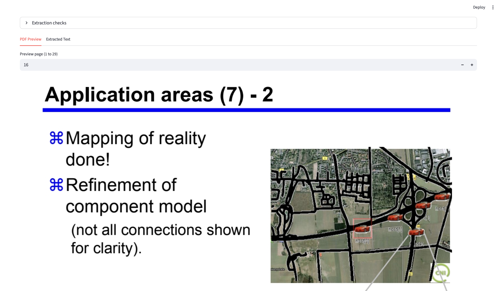
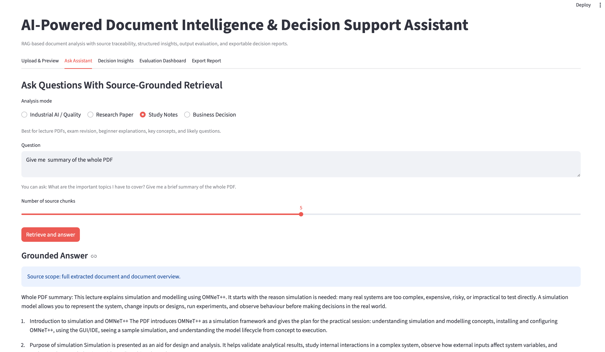

# AI-Powered Document Intelligence & Decision Support Assistant

I built this project as a practical document assistant for working with PDFs, lecture notes, and use-case documents. The first idea was simple: I wanted an app where I could upload a document, preview it, ask questions from it, and get answers that stay connected to the source instead of giving random unsupported text.

While building it, I added more practical layers around the basic "ask a PDF" idea: document overview, page preview, study summaries, decision-support modes, answer evaluation, and exportable reports. My goal was to make it useful for both study material and workplace-style documents such as AI use-case proposals, research notes, and business decision documents.

This is a local Streamlit prototype. It does not use a paid LLM API in the current version, so the logic is kept transparent and easy to inspect.

## What It Does

- Upload PDF, TXT, or Markdown documents.
- Preview uploaded PDF pages inside the app.
- View extracted text page by page for checking and copying.
- Keep a small local study library of recently processed documents.
- Ask questions using source-grounded retrieval over document chunks.
- Generate brief summaries, whole-document summaries, important topics, and beginner explanations.
- Switch between Study Notes, Industrial AI / Quality, Research Paper, and Business Decision modes.
- Extract structured decision insights such as risks, requirements, recommendations, and missing information.
- Evaluate answers for relevance, completeness, grounding, consistency, and hallucination risk.
- Export outputs as JSON, CSV, or Markdown reports.

## Why I Built It

I wanted this project to feel closer to a practical AI tool than a notebook experiment. In real use, just getting an answer is not enough. I also wanted to know:

- Which part of the document the answer came from.
- Whether the answer is actually grounded in the uploaded file.
- Whether a diagram or page should be checked manually.
- What the document is mainly about before asking detailed questions.
- How the same assistant could support study, research, and business-style analysis.

That is why the app includes source chunks, PDF preview, extracted page text, document-level summaries, and an evaluation dashboard.

## Screenshots

### Upload and Study Library


### PDF Preview


### Source-Grounded Assistant


### Evaluation Dashboard


## Main Modes

The app has four analysis modes. The mode changes the answer style and what the assistant focuses on.

- **Study Notes:** lecture summaries, beginner explanations, important topics, page navigation, and exam revision.
- **Industrial AI / Quality:** risks, data requirements, KPIs, validation points, and pilot-readiness checks.
- **Research Paper:** problem, method, dataset, experiments, results, limitations, and future work.
- **Business Decision:** stakeholders, inputs, outputs, risks, dependencies, recommendations, and next actions.

## How It Works

```text
Upload document
      |
Extract text from PDF/TXT/MD
      |
Create overlapping text chunks
      |
Build TF-IDF retrieval index
      |
Detect the question intent
      |
Retrieve relevant source chunks
      |
Generate a mode-aware answer
      |
Evaluate answer quality
      |
Show answer, sources, dashboard, and exports
```

## Evaluation Layer

I added a simple evaluation layer because document assistants can easily sound confident even when the answer is weak. The dashboard checks:

- **Relevance:** how well the answer matches the question.
- **Completeness:** whether important expected points are missing.
- **Grounding:** whether the answer is supported by retrieved document text.
- **Consistency:** whether the answer format is stable and clear.
- **Hallucination risk:** a warning signal when the answer is not strongly supported.

This does not replace human review, but it helps decide when the output should be checked more carefully.

## Tech Stack

- Python
- Streamlit
- scikit-learn TF-IDF retrieval
- Pandas
- NumPy
- pypdf for text extraction
- pypdfium2 for PDF page preview

## Project Structure

```text
app.py
requirements.txt
.streamlit/config.toml
data/sample_documents/
src/
  document_loader.py
  text_chunker.py
  retriever.py
  rag_assistant.py
  insight_extractor.py
  evaluator.py
  exporter.py
```

Runtime folders such as `.app_cache/`, `static/pdf_cache/`, and `outputs/` are ignored by Git because they may contain uploaded documents or generated files.

## Run Locally

```bash
python3 -m venv .venv
source .venv/bin/activate
pip install -r requirements.txt
streamlit run app.py
```

## Example Questions I Tested

Study:

- Give me a brief summary of the whole PDF.
- Give me the whole summary of the PDF.
- What are the important topics I have to cover?
- Explain this topic like I am a beginner.
- Which page contains this topic?

Industrial AI / Quality:

- What are the key risks and recommended next steps?
- What data is required for this use case?
- How should this prototype be evaluated?
- Which information is missing before a pilot?

Research:

- What is the problem, method, result, and limitation?
- What datasets or experiments are mentioned?
- Which claims need stronger evidence?

Business Decision:

- What decision is being supported?
- What are the benefits, risks, and dependencies?
- What should be validated before implementation?

## Current Limitations

- Retrieval currently uses TF-IDF instead of dense semantic embeddings.
- Answer generation is rule-based and template-guided in this version.
- PDF extraction depends on the quality of the uploaded PDF.
- Image-only diagrams cannot always be understood from text extraction alone, so the app adds a manual-review note where needed.
- The domain modes can still be improved with stronger templates and better evaluation logic.

## Future Improvements

- Add embedding-based retrieval with FAISS or Chroma.
- Add optional LLM generation with stricter citations.
- Add multi-document search across a full subject folder.
- Add flashcards, quiz generation, and exam-preparation mode.
- Improve research-paper and industrial-quality templates.
- Add a cleaner deployment version for laptop or phone access.
- Export polished PDF reports.

## Resume Summary

Built a Streamlit-based document intelligence assistant for PDF/TXT/Markdown files with source-grounded retrieval, PDF preview, extracted page text, local study library, study and decision-support modes, answer-quality evaluation, hallucination-risk indicators, and exportable JSON/CSV/Markdown reports.
