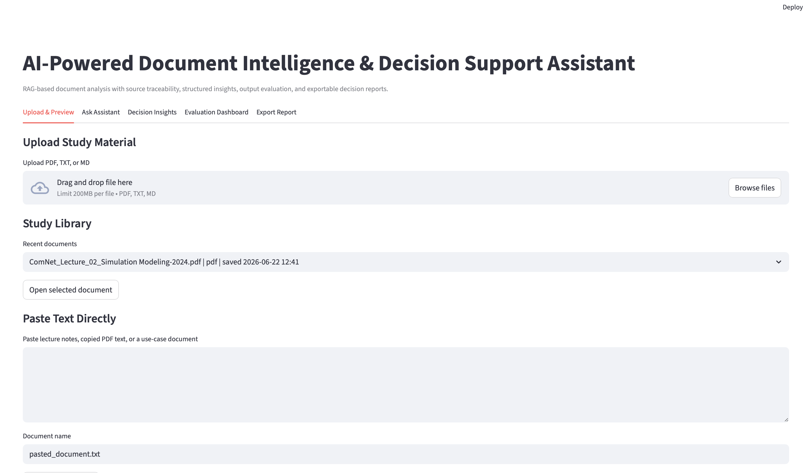
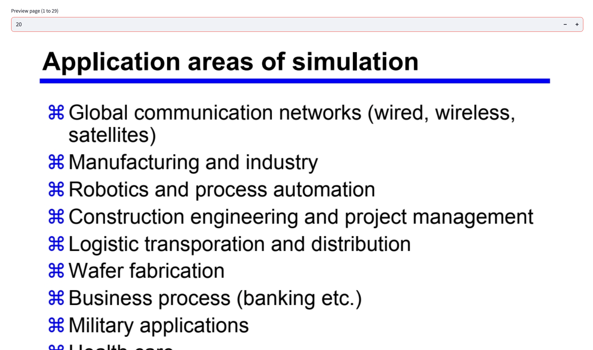
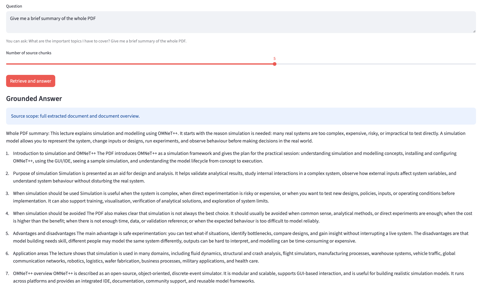
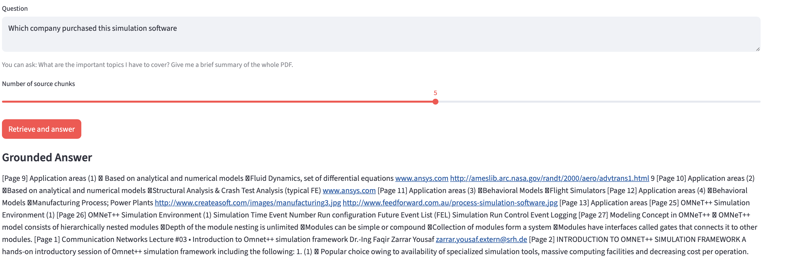
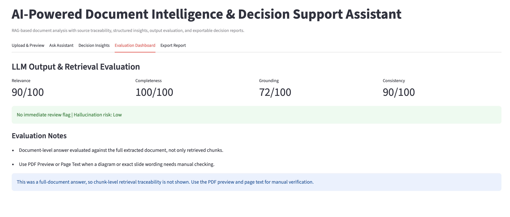
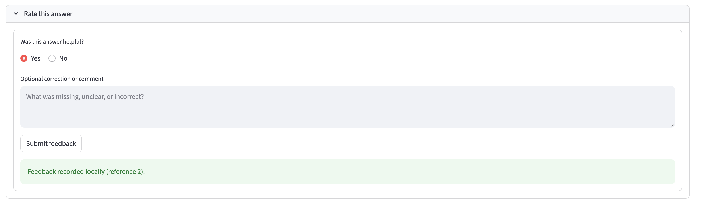
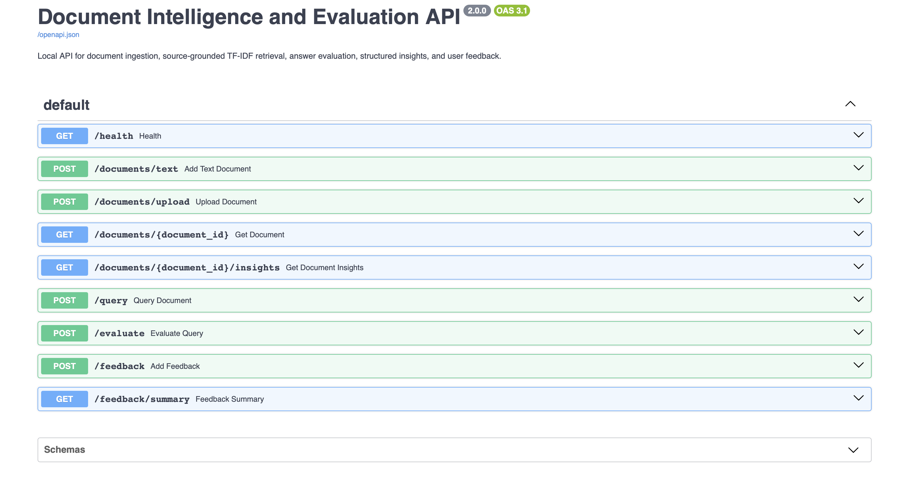

# AI-Powered Document Intelligence & Decision Support Assistant

I started this project because I wanted a better way to work through long lecture PDFs. Finding a sentence was not enough: I wanted to ask a question, see the source behind the answer, and know when the document did not contain enough evidence.

The project grew into a local document-analysis prototype for study material and workplace-style documents. It now has a Streamlit interface, a reusable Python service, a REST API, answer-quality checks, local feedback collection, a regression benchmark, tests, Docker support, and CI.

The current version deliberately uses transparent TF-IDF retrieval and extractive, template-guided answers. It does not call a hosted LLM API, so documents stay local and the answer path is easier to inspect.

## The Problem It Tries to Solve

Students often have several lecture files and limited revision time. A normal search can find matching words, while a general chatbot may answer confidently without showing whether the answer came from the uploaded notes.

This assistant is designed around three practical questions:

1. Can I find the relevant part of a document quickly?
2. Can I verify the answer against its source?
3. Will the system refuse a question when the document does not support it?

The same workflow can also be used to inspect AI use-case proposals, research notes, and business decision documents.

## What It Does

- Uploads PDF, DOCX, image, TXT, and Markdown documents with type, size, and readable-text validation.
- Uses OCR fallback for screenshots and image-heavy PDF pages when normal text extraction is not enough.
- Previews PDF pages and extracted page text.
- Keeps a small local library of recently processed documents.
- Splits text into overlapping chunks and retrieves evidence with TF-IDF.
- Checks whether meaningful concepts from the question are supported by the document.
- Refuses unsupported questions instead of returning the nearest unrelated paragraph.
- Provides Study Notes, Industrial AI / Quality, Research Paper, and Business Decision modes.
- Extracts risks, requirements, recommendations, action items, and missing information.
- Evaluates relevance, completeness, grounding, consistency, and review risk.
- Stores helpful / not-helpful feedback and optional corrections in local SQLite.
- Exports JSON, CSV, and Markdown reports.
- Exposes ingestion, query, evaluation, insight, and feedback endpoints through FastAPI.

## Screenshots

### Upload and Study Library


### PDF Preview and Extracted Text


### Source-Grounded Answer


### Unsupported-Question Refusal


### Evaluation Dashboard


### Local User Feedback


### FastAPI Documentation


## How It Works

```text
Document
   |
Validation and text extraction
   |
Overlapping text chunks
   |
TF-IDF retrieval index
   |
Question support check
   |-------------------- unsupported -> refusal + review flag
   |
Intent-aware extractive answer
   |
Grounding and quality evaluation
   |
Sources, feedback, insights, and exports
```

The Streamlit app and API share the same configuration and core processing modules. Operational logs include IDs, counts, latency, and review status, but not document contents.

## Controlled Evaluation

I created a small golden dataset with 21 questions across three included sample documents:

- 18 answerable questions
- 3 intentionally unanswerable questions
- industrial visual inspection, cost engineering, and clinical documentation examples

The current regression run achieved:

| Check | Result |
|---|---:|
| Overall pass rate | 21/21 |
| Retrieval hit rate | 18/18 |
| Correct refusal rate | 3/3 |
| Mean expected-keyword coverage | 100% |
| Mean grounding score | 67.33/100 |

These numbers are useful for catching regressions in the included examples. They are not a claim of 100% accuracy on unseen documents or real users. The dataset and recorded result are available in `evaluation_data/`.

Run the benchmark with:

```bash
python run_evaluation.py
```

## REST API

Start the API:

```bash
uvicorn api:app --reload
```

Open `http://127.0.0.1:8000/docs` for the interactive endpoint documentation.

Main endpoints:

| Method | Endpoint | Purpose |
|---|---|---|
| `GET` | `/health` | Service and retrieval status |
| `POST` | `/documents/text` | Ingest pasted text |
| `POST` | `/documents/upload` | Upload PDF, DOCX, image, TXT, or Markdown |
| `GET` | `/documents/{id}/insights` | Structured decision insights |
| `POST` | `/query` | Answer with sources and support evidence |
| `POST` | `/evaluate` | Return answer-quality metrics |
| `POST` | `/feedback` | Store a local rating or correction |
| `GET` | `/feedback/summary` | Summarise collected feedback |

Documents are held in memory for the current API process. This keeps the prototype simple, but it means document IDs do not survive an API restart.

## Run the Streamlit App

```bash
python3 -m venv .venv
source .venv/bin/activate
pip install -r requirements.txt
streamlit run app.py
```

## Tests

```bash
pytest -q
```

The tests cover input validation, grounded queries, unsupported-question refusal, feedback storage, the evaluation dataset, and the API workflow. GitHub Actions runs compilation and tests after pushes and pull requests.

## Docker

The included Dockerfile runs the API:

```bash
docker build -t document-intelligence-api .
docker run --rm -p 8000:8000 document-intelligence-api
```

## Project Structure

```text
app.py                         Streamlit interface
api.py                         FastAPI endpoints
run_evaluation.py              Golden-set benchmark runner
evaluation_data/               Questions and recorded benchmark result
data/sample_documents/         Non-sensitive evaluation documents
tests/                         Unit and API tests
src/
  config.py                    Environment-based settings
  document_loader.py           PDF/DOCX/image/TXT/Markdown extraction and OCR fallback
  text_chunker.py              Overlapping chunk creation
  retriever.py                 TF-IDF retrieval
  rag_assistant.py             Intent-aware extractive answers
  service.py                   Reusable document workflow
  validation.py                Input and question-support checks
  evaluator.py                 Answer-quality checks
  insight_extractor.py         Structured decision fields
  feedback_store.py            Local SQLite feedback
  logging_config.py            Privacy-aware operational logging
  exporter.py                  JSON/CSV/Markdown reports
```

## Planned User Study

The next step is a small study with 5–10 students using non-sensitive lecture PDFs. I want to measure task time, source retrieval, unsupported-question refusal, helpfulness, corrections, and confidence after source verification.

The complete plan and five-question survey are in [USER_STUDY.md](USER_STUDY.md). Results will only be added after the study is actually completed.

## Privacy

Uploaded documents, previews, feedback, and exports remain local in the default setup. Runtime files and databases are excluded from Git. More detail is available in [PRIVACY.md](PRIVACY.md).

## Current Limitations

- TF-IDF does not understand meaning as deeply as embedding-based retrieval.
- Answers are extractive and template-guided, not generated by an LLM.
- The support check is lexical and can miss paraphrases.
- OCR can read many screenshot-based slides and scanned pages, but complex charts, diagrams, and low-quality images may still need manual review.
- The benchmark is small and based on included sample documents.
- The API uses in-memory document storage and is not a production deployment.

## Next Steps

- Run the planned student study and report measured results.
- Add dense retrieval and compare it against the TF-IDF baseline.
- Add optional LLM generation with citations and strict fallback behavior.
- Test a larger, more varied golden dataset.
- Add persistent document metadata without storing sensitive source text by default.
